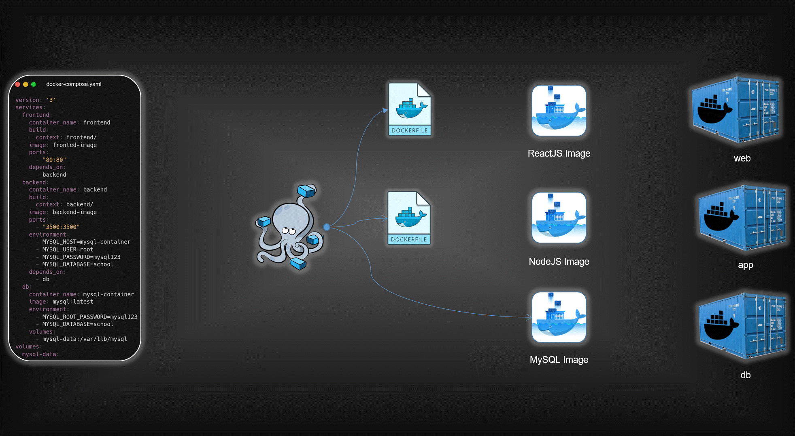

# Three-Tier Application Deployment using Docker Compose
[](https://www.linkedin.com/in/aman-devops/)
[](https://github.com/AmanPathak-DevOps)
[](https://hub.docker.com/u/avian19)



This repository showcases the deployment of a three-tier application using Docker Compose. The application consists of a MySQL database, a Node.js backend, and a React.js frontend.

## Prerequisites

Before you begin, make sure you have the following installed:

- [Docker](https://www.docker.com/get-started)
- [Docker Compose](https://docs.docker.com/compose/install/)

## Project Structure

- **frontend**: Dockerfile and related files for the React.js frontend.
- **backend**: Dockerfile and related files for the Node.js backend.
- **docker-compose.yml**: Docker Compose configuration file.
- **student-teacher-app**: Code for the frontend application.
- **backend**: Code for the backend application.

## Deployment Steps

1. **Clone the Repository:**
   ```bash
   git clone <repository-url>
   cd <repository-directory>
   ```

2. **Build and Run Docker Containers:**
    Use Docker Compose to build and run all containers:
    ```bash
    docker-compose up -d
    ```

3. **Access the Application:**

    Open your favorite browser and visit http://localhost:80. Explore the MERN stack application!

## Data Persistence
    Data persistence is ensured by using Docker volumes. If the MySQL container is deleted, data remains available and is automatically added to a new Docker container by providing the same Docker volume.

    Feel free to explore and modify the Docker Compose file and related files to enhance your understanding of containerization and deployment using Docker Compose! Happy coding! 🚀